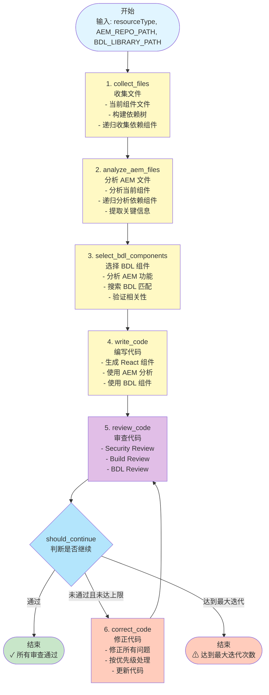
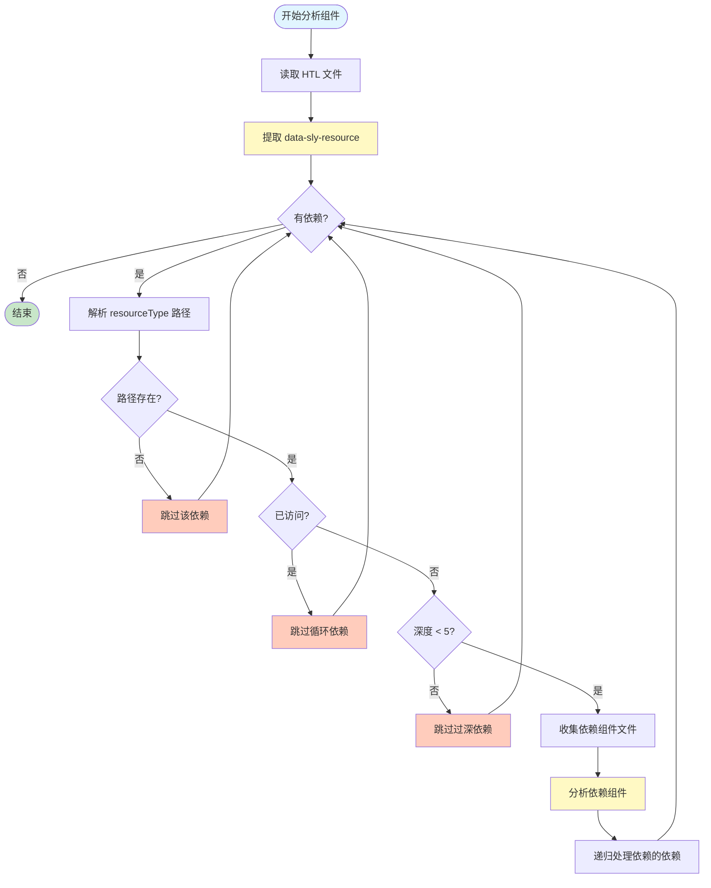
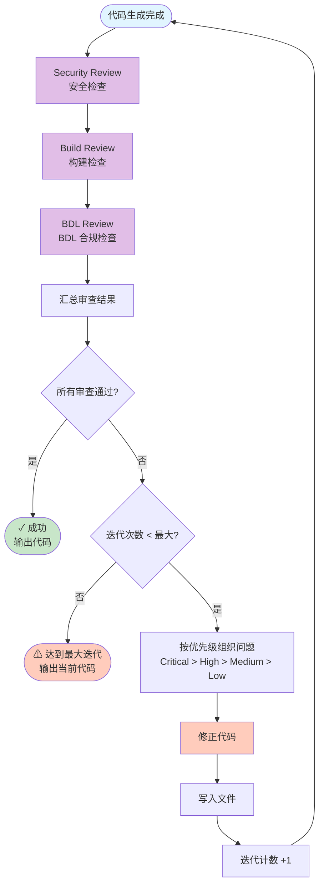
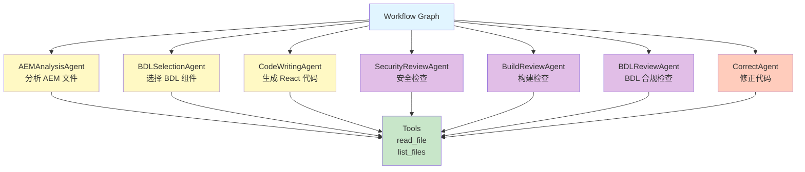
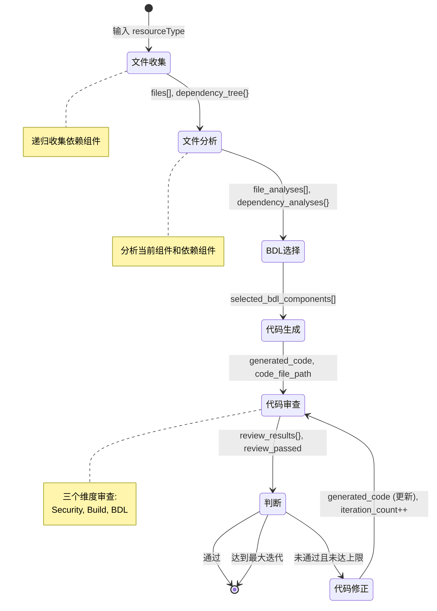
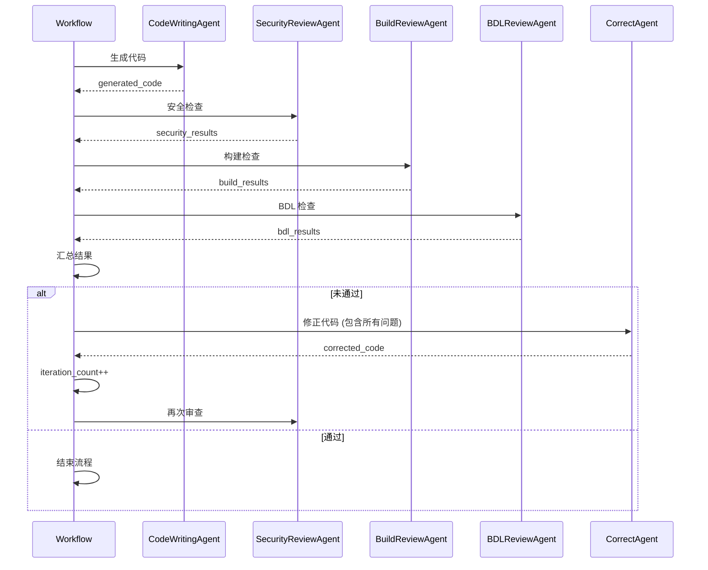

# AEM to React Component Converter - 工作流可视化

## 🔄 完整工作流程图 (Mermaid)



## 📊 数据流图

```mermaid
graph LR
    Input[输入<br/>resourceType<br/>Paths] --> Collect[文件收集]
    
    Collect --> Files[files[]<br/>dependency_tree{}]
    
    Files --> Analyze[文件分析]
    
    Analyze --> Analyses[file_analyses[]<br/>dependency_analyses{}]
    
    Analyses --> Select[BDL 选择]
    
    Select --> BDL[selected_bdl_components[]]
    
    BDL --> Generate[代码生成]
    
    Generate --> Code[generated_code<br/>code_file_path]
    
    Code --> Review[代码审查]
    
    Review --> Results[review_results{}<br/>review_passed]
    
    Results -->|通过| Output[输出<br/>React 组件]
    Results -->|未通过| Correct[代码修正]
    
    Correct --> Generate
    
    style Input fill:#e1f5ff
    style Output fill:#c8e6c9
    style Collect fill:#fff9c4
    style Analyze fill:#fff9c4
    style Select fill:#fff9c4
    style Generate fill:#fff9c4
    style Review fill:#e1bee7
    style Correct fill:#ffccbc
```

## 🏗️ 依赖处理流程图



## 🔍 审查循环流程图



## 🎯 Agent 交互图



## 📦 状态流转图



## 🔄 迭代优化循环



---

## 📝 关键节点说明

### 1. 文件收集 (collect_files)
- **输入**: component_path, resource_type, aem_repo_path
- **处理**: 
  - 收集当前组件文件
  - 提取依赖关系
  - 递归收集依赖组件文件
- **输出**: files[], dependency_tree{}

### 2. 文件分析 (analyze_aem_files)
- **输入**: files[], dependency_tree{}
- **处理**:
  - 分析 HTL 模板（UI 结构）
  - 分析 Dialog XML（Props 定义）
  - 分析 JavaScript（交互逻辑）
  - 递归分析依赖组件
- **输出**: file_analyses[], dependency_analyses{}

### 3. BDL 选择 (select_bdl_components)
- **输入**: file_analyses[], bdl_library_path
- **处理**:
  - 构建 AEM 组件摘要
  - 搜索匹配的 BDL 组件
  - 验证相关性
  - 重新搜索（如需要）
- **输出**: selected_bdl_components[], aem_component_summary{}

### 4. 代码生成 (write_code)
- **输入**: file_analyses[], dependency_analyses{}, selected_bdl_components[]
- **处理**:
  - 构建转换要求
  - 生成 React 代码
  - 基本验证
- **输出**: generated_code, code_file_path

### 5. 代码审查 (review_code)
- **输入**: generated_code, code_file_path
- **处理**:
  - Security Review
  - Build Review
  - BDL Review
- **输出**: review_results{}, review_passed

### 6. 代码修正 (correct_code)
- **输入**: generated_code, review_results{}, iteration_count
- **处理**:
  - 按优先级修正问题
  - 更新代码
- **输出**: generated_code (更新), iteration_count++

---

## 🎯 总结

整个工作流是一个**自动化的、迭代优化的**转换系统：

1. **收集阶段**: 递归收集所有相关文件
2. **分析阶段**: 深入分析 AEM 组件和依赖
3. **选择阶段**: 智能匹配 BDL 组件
4. **生成阶段**: 生成 React 代码
5. **审查阶段**: 多维度质量检查
6. **优化阶段**: 迭代修正直到通过

整个过程**自动化**、**智能化**、**可迭代**，确保生成高质量的 React 组件！🎉
